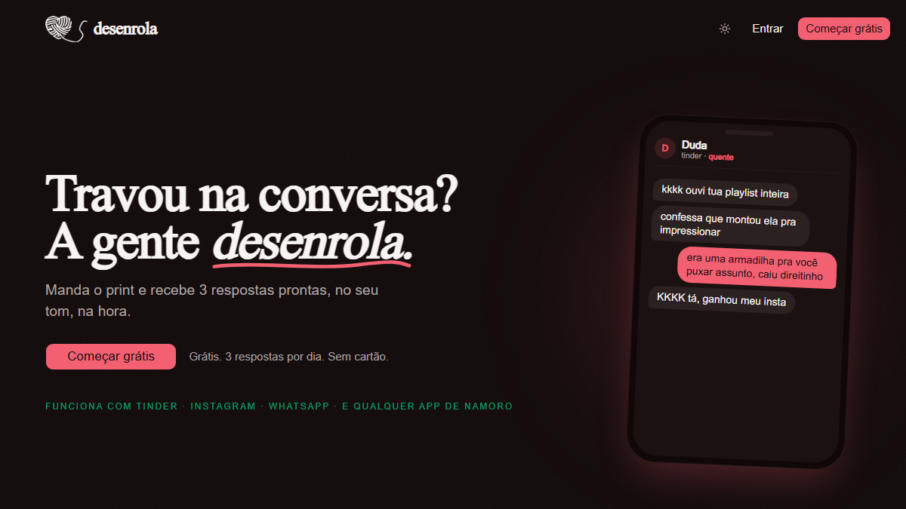
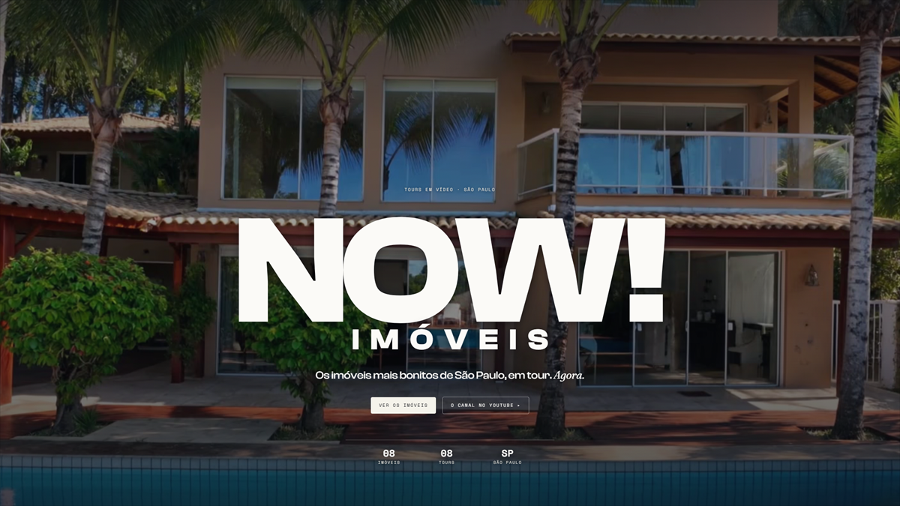

<h1 align="center">André Miller Fleck</h1>

  <strong>Full-Stack Developer · Product Builder</strong>

  Building real products across full-stack development, AI automation and creative technology.

  React · TypeScript · Next.js · Node.js · Python · AI/LLMs · Three.js/WebGL

  <a href="https://www.linkedin.com/in/andrefleckm/">LinkedIn</a>
  ·
  <a href="https://x.com/andrefleckm">X</a>
  ·
  <a href="https://www.behance.net/dreds">Behance</a>
  ·
  <a href="https://desenrola.app">Desenrola</a>

---

## About

I build digital products across front end, back end, APIs, automation and AI-assisted workflows.

My core stack includes **React, TypeScript, Next.js, Node.js and Python**, with additional work around **LLMs, AI automation, Three.js and WebGL**.

I'm especially interested in the point where engineering, product thinking and interface quality meet. My background in **Graphic Design** gives me a strong visual and usability perspective while building software.

Much of my current work happens inside real products whose source code is private. This profile focuses on what can be shown publicly: the products, technical scope, decisions and work behind them.

---

## Selected products

### Desenrola

  

An AI-assisted conversation product designed to help users respond with better context instead of starting from scratch every time.

The product works with conversation screenshots, generates multiple response options, supports tone and context refinement, and maintains individual history for each contact.

I work directly on its development and evolution across **software, product decisions, UX and practical AI integration**.

**Focus:** Full-stack product development · AI-assisted workflows · Context systems · UX

<a href="https://desenrola.app"><strong>View live product →</strong></a>

<a href="https://github.com/DredsGG/desenrola"><strong>View product case study →</strong></a>

---

### CliniTosa

A multi-tenant SaaS platform for pet-care businesses.

I contribute across the stack, working with **React and TypeScript** on the front end, **Node.js and Python** on the back end, REST APIs, front-end/back-end integration and multi-tenant application architecture.

The project involves interconnected technical and business requirements inside a real operational product.

**Focus:** Full-stack development · REST APIs · Multi-tenant architecture · Product engineering

**Stack:** React · TypeScript · Node.js · Python

> Source code and product interface are private.

---

### Jarvis

An Obsidian plugin focused on workflow, knowledge management and AI-assisted automation.

I actively develop and use Jarvis in my own workflow, working on its architecture, integrations and automation flows using **TypeScript, Node.js and APIs**.

Because I use the product myself, its development is continuously driven by real problems around knowledge organization, productivity and AI-assisted workflows.

**Focus:** Plugin architecture · Knowledge management · AI automation · Workflow systems

**Stack:** TypeScript · Node.js · APIs

> Source code is private.

---

## Other work & ventures

### NOW! Imóveis

  

A video-first real-estate platform and channel showcasing property tours in São Paulo.

I contribute to NOW! Imóveis on the **business, operational and communication side**, participating in its day-to-day activities and collaboration with the team.

My involvement in this initiative is **non-technical and separate from the software products above**.

**Focus:** Business operations · Communication · Collaboration

<a href="https://nowimoveis.com/"><strong>View website →</strong></a>

> My involvement here is non-technical. The website itself is developed by Hertwave.

---

## Technical toolkit

### Core development

  

**Languages:** JavaScript · TypeScript · Python  
**Front end:** React · Next.js  
**Back end:** Node.js · REST APIs · API integration  
**Version control:** Git

### AI & automation

LLMs · AI-assisted workflows · Automation · Multi-agent systems

### Creative development

Three.js · WebGL

---

## How I build

I like working beyond isolated screens or individual features.

My strongest projects usually involve several layers at once:

- turning an idea or real problem into a usable product;
- building and connecting front-end and back-end systems;
- integrating APIs and AI-assisted workflows;
- thinking about usability and interface quality while implementing;
- iterating from actual use rather than treating software as a static deliverable.

---

## Design background

Before focusing on software development, I built a background in **Graphic Design, visual communication and client-facing work**.

That experience still influences how I build products today, particularly around interface quality, information hierarchy, visual systems and communication.

**Design:** Graphic Design · UX/UI · Adobe Photoshop · Illustrator · InDesign

<a href="https://www.behance.net/dreds"><strong>View design work →</strong></a>

---

## Beyond the code

I've also worked across **healthcare, real estate, retail and business environments**.

Those experiences gave me direct exposure to customers, operations, sales, communication and practical problems outside a purely technical environment.

---

  <a href="https://www.linkedin.com/in/andrefleckm/">LinkedIn</a>
  ·
  <a href="https://x.com/andrefleckm">X</a>
  ·
  <a href="https://www.behance.net/dreds">Behance</a>

